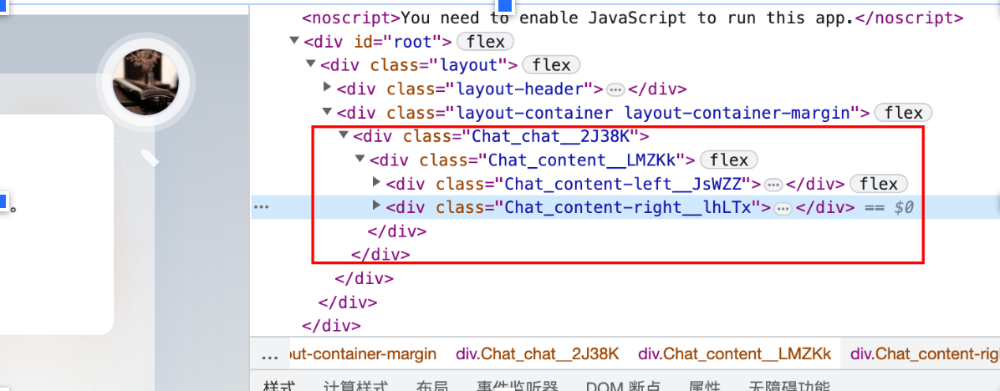
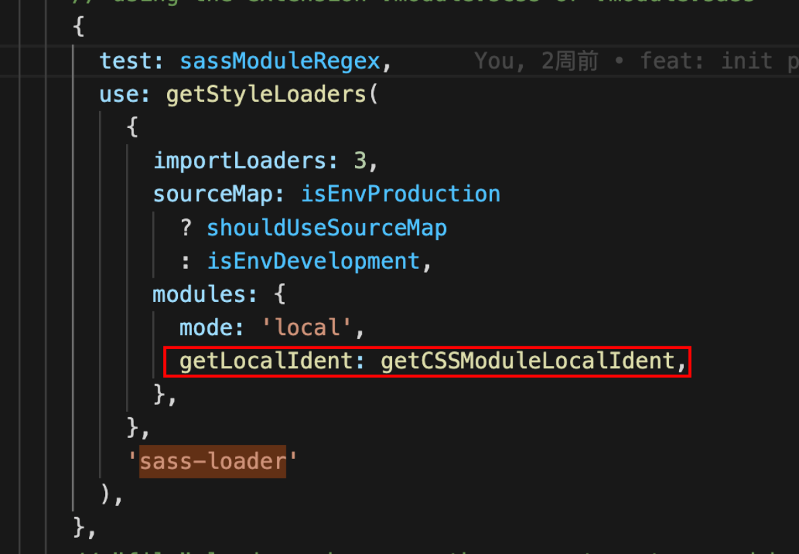

## 是什么

css modules是用于模块化和组合css的系统，通过加入局部作用域、依赖管理来避免全局污染和样式冲突，并且css module在打包的时候会自动将类名转成hash值，完全杜绝css类名冲突问题

### 特性

○作用域：模块中的名称默认属于本地作用域，定义在：loacal中的名称也属于本地作用域，定义在:global中的名称属于全局作用域，全局名称不用被编译成哈希字符串
○命名：对于本地类名称，css modules建议使用camelCase方式来命名，这样会使得js文件更干净，即styles.className。但你仍然也可使用style['class-name'],不过不推荐
○下面两点还没有体会。。。


```js
import styles from './index.moudule.scss';
<div className={style.chat}></div>;
```


