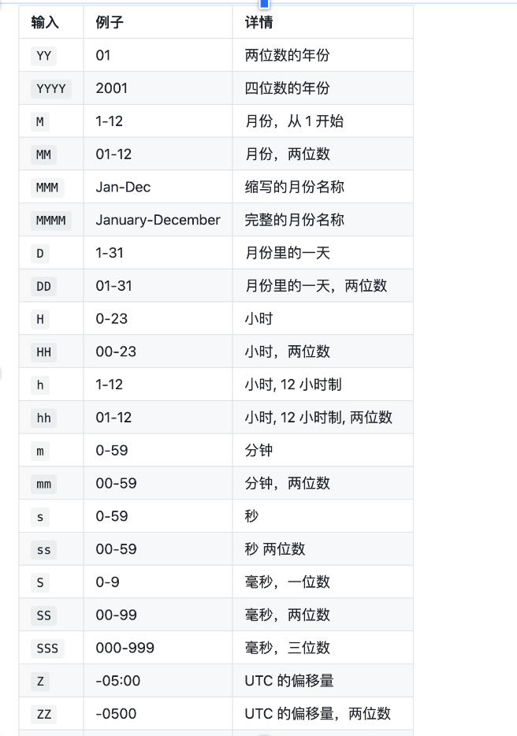

### 获取时间戳

```js
//13位时间戳，精确到毫秒
new Date().getTime();
// 10位时间戳
Math.round(new Date().getTime() / 1000).toString();
```

##### 1、ios8标准时间

```js
dayjs('2018-04-04T16:00:00.000Z');
```

##### 2、utc时间

##### 3、时间戳

（1）精确到毫秒的时候是13位
dayjs(1318781876406)

（2）精确到秒到时候是10位
dayjs.unix(1318781876.721) // 可以支持小数

##### 4、时间段days.duration(' ')

（1）可以将时间段转化为时间错，比如01:29:20

```js
dayjs.duration('01:29:20').valueOf(); //转化为秒
dayjs('2019-01-25').unix(); //转化为毫秒
```

##### 5、将时间戳转化为所要时间

```js
dayjs(1318781876406).format('YYYY-MM-DD HH:mm:ss');
dayjs('1970-00-00', 'YYYY-MM-DD'); //字符串+格式
//占位符表示
```


