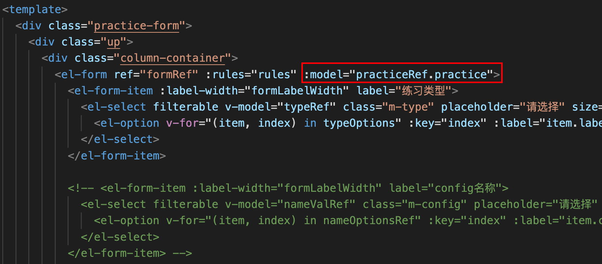
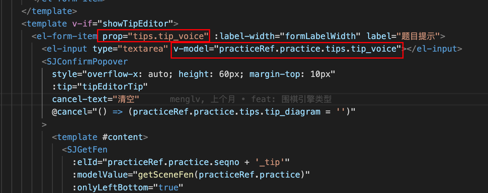

```js
const ruleFormRef = ref<FormInstance>()
<el-form ref="ruleFormRef">
<el-form-item>
  <el-button type="primary" @click="submitForm(ruleFormRef)">
    Create
  </el-button>
  <el-button @click="resetForm(ruleFormRef)">Reset</el-button>
  </el-form-item>
</el-form>
const submitForm = async (formEl: FormInstance | undefined) => {
  if (!formEl) return
  await formEl.validate((valid, fields) => {
    if (valid) {
      console.log('submit!')
    } else {
      console.log('error submit!', fields)
    }
  })
}

const resetForm = (formEl: FormInstance | undefined) => {
  if (!formEl) return
  formEl.resetFields()
}
```

el-form-item中的prop值需要跟v-modal中的字段一样，才能进行rules，resetField等设置


