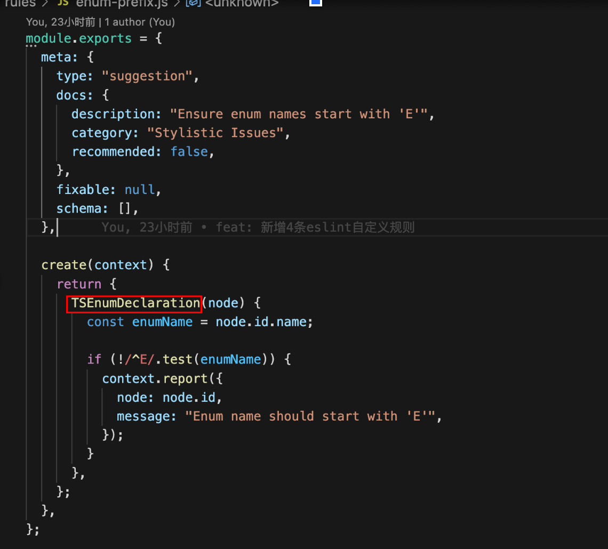

#### eslint / prettier如何做到规范代码的

ESLint 和 Prettier 都是前端开发中常用的代码规范工具，它们可以帮助开发人员规范代码、提高代码质量，并减少代码错误。下面是它们如何规范代码的简要介绍：

###### ●ESLint

○语法检查: ESLint 可以检查代码中是否存在语法错误，例如未定义的变量、语法错误的表达式等
○代码风格检查: ESLint 可以检查代码的风格是否符合规范，例如缩进、变量命名、空格等
○安全性检查: ESLint 可以检查代码中是否存在安全漏洞，例如 XSS 攻击、SQL 注入等
○自定义规则: ESLint 提供了丰富的规则配置，开发人员可以根据自己的需要自定义规则并进行代码检查

###### ●Prettier

○代码格式化: 可以自动格式化代码，使代码符合规范，并保持一致的风格
○代码布局: 可以自动调整代码的布局，使代码易于阅读和理解
○多语言支持: 支持多种编程语言，例如 JavaScript、TypeScript、CSS、Markdown 等

#### eslint / prettier之间的关系

ESLint 和 Prettier 都是前端开发中常用的代码规范工具，它们可以帮助开发人员规范代码、提高代码质量，并减少代码错误。虽然它们都可以用于规范代码，但它们之间有不同的关注点和使用方式。
ESLint 主要用于检查代码风格和语法错误，可以通过配置文件来定制自己的代码风格规范，并提供了丰富的插件和扩展，可以支持各种语言和框架。ESLint 的作用是在编码过程中及时发现和解决代码问题，从而提高代码质量和可维护性。
Prettier 主要用于代码格式化，可以对代码进行自动格式化，使代码符合统一的规范和风格。开发人员可以通过配置文件来定制自己的代码格式化规范，并支持多种语言和框架。Prettier 的作用是将已经编写好的代码快速地格式化成一个统一的格式，从而使代码更加易读、易维护、易扩展。
ESLint 和 Prettier 可以结合使用，通过使用 eslint-plugin-prettier 插件和 eslint-config-prettier 配置来将 Prettier 集成到 ESLint 中。这样可以使用 ESLint 来检查代码风格和语法错误，并使用 Prettier 来进行代码格式化。结合使用可以提高代码质量和开发效率，同时也能够使代码更加统一和规范。
总之，ESLint 和 Prettier 都是前端开发中常用的代码规范工具，虽然它们之间有不同的关注点和使用方式，但可以结合使用来提高代码质量和开发效率。

#### eslint/prettier 在react和vue项目中如何使用

###### ●react项目

○安装eslint/prettier相关插件
npm install eslint prettier eslint-plugin-react eslint-config-prettier eslint-plugin-prettier --save-dev

○创建.eslintrc.json配置文件

```js
{
  "extends": [
    "eslint:recommended",
    "plugin:react/recommended",
    "plugin:prettier/recommended",
    "prettier/react"
  ],
  "plugins": ["react", "prettier"],
  "rules": {
    "prettier/prettier": ["error", {}, { "usePrettierrc": true }]
  }
}
```

○创建.prettierrc.json配置文件

```js
{
  "printWidth": 80,
  "tabWidth": 2,
  "useTabs": false,
  "semi": true,
  "singleQuote": true,
  "jsxSingleQuote": true,
  "trailingComma": "es5",
  "bracketSpacing": true,
  "jsxBracketSameLine": false,
  "arrowParens": "always"
}
```

○在编辑器中安装并配置eslint和prettier插件，例如 VS Code中可以安装ESLint和Prettier插件，并在setting.json文件中添加以下配置

```js
"editor.formatOnSave": true,
"editor.defaultFormatter": "esbenp.prettier-vscode",
"editor.codeActionsOnSave": {
    "source.fixAll.eslint": true
},
```

###### ●vue项目（注：和上面react项目步骤基本一样，唯一的区别就是安装的eslint/prettier插件有区别，最下面👇再来解释一下为什么

○安装eslint/prettier相关插件

```js
npm install eslint prettier eslint-plugin-vue eslint-config-prettier eslint-plugin-prettier --save-dev
```

○创建.eslintrc.json配置文件

```js
{
  "extends": [
    "eslint:recommended",
    "plugin:vue/recommended",
    "plugin:prettier/recommended",
    "prettier/vue"
  ],
  "plugins": ["vue", "prettier"],
  "rules": {
    "prettier/prettier": ["error", {}, { "usePrettierrc": true }]
  }
}
```

○创建.prettierrc.json配置文件

```js
{
  "printWidth": 80,
  "tabWidth": 2,
  "useTabs": false,
  "semi": true,
  "singleQuote": true,
  "trailingComma": "es5",
  "bracketSpacing": true
}
```

○在编辑中安装eslint和prettier插件，例如VS Code中可以安装ESLint和Prettier插件，并在setting.json中添加以下配置

```js
"editor.formatOnSave": true,
"editor.defaultFormatter": "esbenp.prettier-vscode",
"editor.codeActionsOnSave": {
    "source.fixAll.eslint": true
},
```

(vue和react存在模版语法、组件命名、状态管理等方面的差异，隐藏需要根据具体框架使用合适的插件和扩展，以确保代码可读性和可维护性，提高代码质量和开发效率
（1）模版语法： 在vue中，模版语法是一种重要的语法结构，需要进行检查和规范，可以使用eslint-plugin-vue来检查模版语法问题；而在react中，通常使用jsx语法来定义组件，可以使用eslint-plugin-react来检查jsx相关代码
（2）组件命名：在vue中，组件命名采用kebab-case(短横线命名法），例如my-component。而在react中，采用PascalCase（大驼峰），例如MyComponent。需要根据具体的框架选择合适的命名规范
（3）状态管理，在vue中使用vuex，react中使用redux\mobx等状态管理库
（4）插件和扩展：vue和react需要使用不同的扩展工具，例如：eslint-plugin-react和eslint-plugin-vue

#### 怎么自定义规范（实践）

(1)使用官方生成自定义eslint规范的脚手架工具

```js
// 安装环境
npm i -g yo
npm i -g generator-eslint
// cd 要放置项目的文件夹，创建项目
yo eslint:plugin
//下面是创建之后需要输入的信息
//yo eslint:rule
//What is your name? 随便写个你的名字
//What is the plugin ID? 你的插件的id，推荐(eslint-plugin-xxx)的命名方式
//Type a short description of this plugin: 描述你的插件是干啥的
//Does this plugin contain custom ESLint rules? Yes
//Does this plugin contain one or more processors? Yes
```

生成下面目录

(2)在lib/rules/my-custom-rules1.js中写自定义的规则，下面是基本模版

```js
module.exports = {
  // meta里面的元数据，对于我们自定义规则，其实只关心schema就行了
  meta: {
    // 规则的类型problem|suggestion|layout
    // problem: 这条规则识别的代码可能会导致错误或让人迷惑。应该优先解决这个问题
    // suggestion: 这条规则识别的代码不会导致错误，但是建议用更好的方式
    // layout: 表示这条规则主要关心像空格、分号等这种问题
    type: 'suggestion',
    // 对于自定义规则，docs字段是非必须的
    docs: {
      description: '描述你的规则是干啥的',
      // 规则的分类，假如你把这条规则提交到eslint核心规则里，那eslint官网规则的首页会按照这个字段进行分类展示
      category: 'Possible Errors',
      // 假如你把规则提交到eslint核心规则里
      // 且像这样extends: ['eslint:recommended']继承规则的时候，这个属性是true，就会启用这条规则
      recommended: true,
      // 你的规则使用文档的url
      url: 'https://eslint.org/docs/rules/no-extra-semi',
    },
    // 标识这条规则是否可以修复，假如没有这属性，即使你在下面那个create方法里实现了fix功能，eslint也不会帮你修复
    fixable: 'code',
    // 这里定义了这条规则需要的参数
    // 比如我们是这样使用带参数的rule的时候，rules: { myRule: ['error', param1, param2....]}
    // error后面的就是参数，而参数就是在这里定义的
    schema: [],
  },
  create: function (context) {
    // 这是最重要的方法，我们对代码的校验就是在这里做的
    return {
      // callback functions
    };
  },
};
```

接下来介绍creact方法
eslint校验代码其实是解析文件内容，通过AST(抽象语法树）生成一个对象，再检查这个对象是否符合我们的要求，如果不符合要求就报出错误
下面举例

```js
enum myEnumText {
firstName = 1
}
```

//下面是它的AST形式

```js
  sourceType: module
  body: [
    EnumDeclaration: {
      id: Identifier {
        name: "myEnumText"
      }
      body: {
        type: EnumBooleanBody
        members: [
          EnumBooleanMember: {
            id: Identifier {
              name: "firstName"
            }
            init: NumericLiteral {
              value: 1
            }
          }
        ]
      }
    }
  ]
```

从上面代码可以看出，enum类型的声明变量名是EnumDeclaration，并且通过node.id.name可以获取到声明的变量名，我们通过正则可以校验这个变量名是否以E开头，如果不以E开头就报错或者警告

（3）接下来是怎么在项目中使用（这里我的插件名称是eslint-plugin-st-rules
●将上面的项目发布成npm插件，npm login / npm publish

```js
npm login --registry="具体发包地址"
npm publish --registry="具体发包地址"
```

●在项目中npm install eslint-plugin-rules

```js
npm install  eslint-plugin-rules --"具体发包地址"
```

●在.eslintrc.js中 (在这里可以省略eslint-plugin-)

```js
 plugins: ['st-rules'],
  rules: {
    'st-rules/type-prefix': 'warn', // type类型要用T开头
    'st-rules/interface-prefix': 'warn', // interface类型要用I开头
    'st-rules/enum-prefix': 'warn', // enum类型要用E开头
    'st-rules/variable-name-camelcase': 'warn', // let var定义的变量需要用小驼峰
  },
```

⚠️更改了.eslintrc.js文件，需要关掉项目重新打开才会生效
