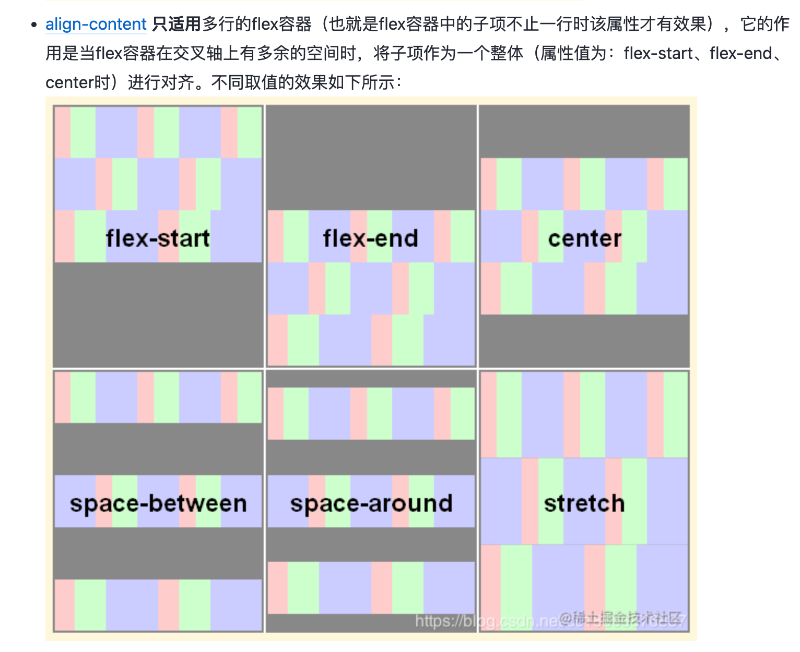
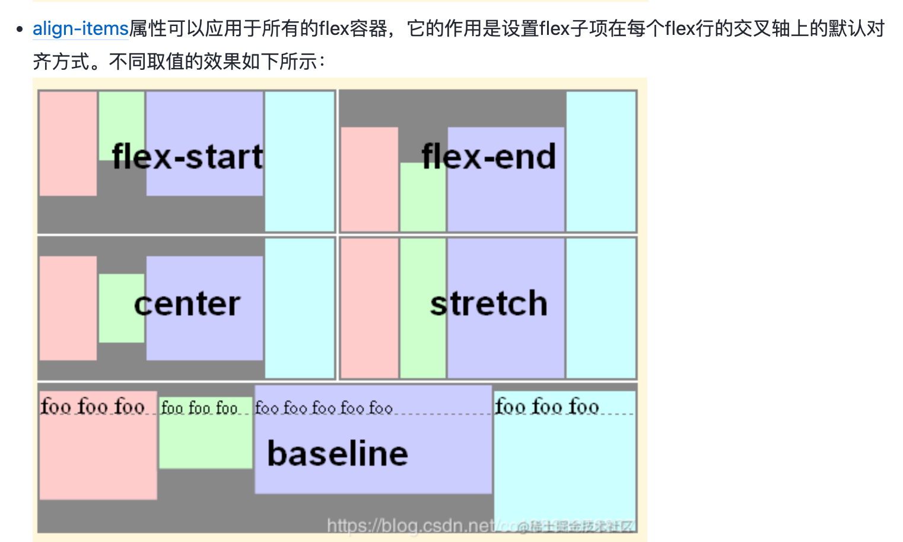

#### align-content、align-items、align-self区别

●align-content（flex-start/flex-end/center/stretch/space-between/space-around

●align-items

●align-self
align-self属性规定的是flex容器规定的align-items属性，同样也只能规定在交叉轴上的对齐方式，默认align-self:auto,所以会继承align-items属性
